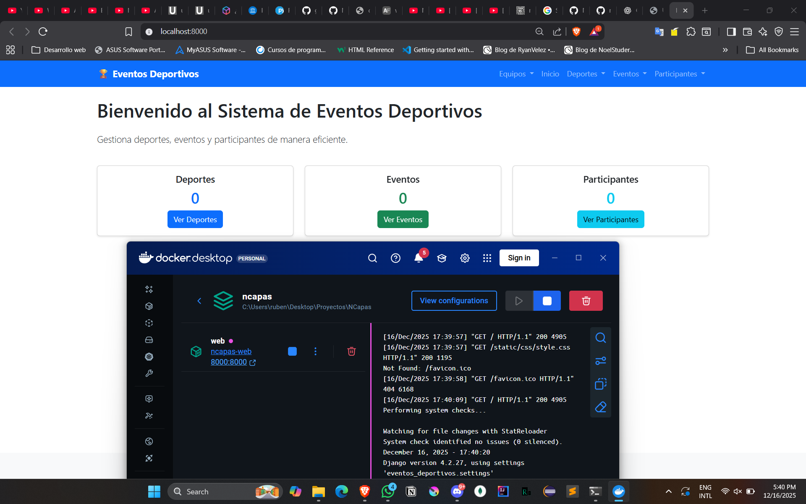
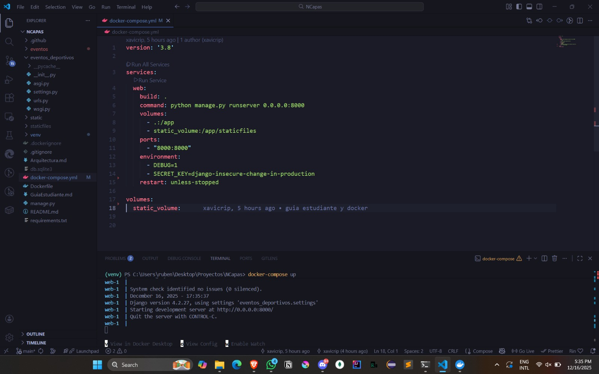

Ejecución con Docker:



# Arquitectura del Sistema de Eventos Deportivos

## Índice

1. [Introducción](#introducción)
2. [Arquitectura en 3 Capas](#arquitectura-en-3-capas)
3. [Patrón MVC](#patrón-mvc)
4. [Descripción de Capas](#descripción-de-capas)
5. [Flujo de Datos](#flujo-de-datos)
6. [Componentes y Responsabilidades](#componentes-y-responsabilidades)
7. [Diagramas de Arquitectura](#diagramas-de-arquitectura)
8. [Ventajas de la Arquitectura](#ventajas-de-la-arquitectura)

---

## Introducción

El Sistema de Eventos Deportivos está diseñado siguiendo una **Arquitectura en 3 Capas** (Three-Tier Architecture) combinada con el patrón **MVC** (Model-View-Controller). Esta arquitectura proporciona una separación clara de responsabilidades, facilitando el mantenimiento, la escalabilidad y la prueba del sistema.

### Principios Arquitectónicos

- **Separación de Responsabilidades**: Cada capa tiene una responsabilidad específica y bien definida
- **Bajo Acoplamiento**: Las capas se comunican a través de interfaces bien definidas
- **Alta Cohesión**: Los componentes dentro de cada capa están relacionados funcionalmente
- **Reutilización**: Los servicios y repositorios pueden ser reutilizados en diferentes contextos
- **Testabilidad**: Cada capa puede ser probada de forma independiente

---

## Arquitectura en 3 Capas

La arquitectura del sistema se organiza en tres capas principales:

```
┌─────────────────────────────────────────────────────────────┐
│                    CAPA DE PRESENTACIÓN                      │
│  ┌──────────────────┐         ┌──────────────────┐       │
│  │   Controllers     │         │     Templates      │       │
│  │   (Django Views)  │         │      (HTML)        │       │
│  └──────────────────┘         └──────────────────┘       │
│           │                              │                   │
│           └──────────┬───────────────────┘                   │
│                      │                                       │
└──────────────────────┼───────────────────────────────────────┘
                       │
                       ▼
┌─────────────────────────────────────────────────────────────┐
│              CAPA DE LÓGICA DE NEGOCIO                      │
│  ┌──────────────────────────────────────────────────────┐  │
│  │              Services (Business Logic)               │  │
│  │  - DeporteService                                     │  │
│  │  - EventoService                                     │  │
│  │  - ParticipanteService                                │  │
│  └──────────────────────────────────────────────────────┘  │
│                       │                                      │
└───────────────────────┼──────────────────────────────────────┘
                       │
                       ▼
┌─────────────────────────────────────────────────────────────┐
│              CAPA DE ACCESO A DATOS                         │
│  ┌──────────────────┐         ┌──────────────────┐       │
│  │     Models        │         │   Repositories   │       │
│  │  (Django ORM)     │         │  (Data Access)   │       │
│  └──────────────────┘         └──────────────────┘       │
│           │                              │                   │
│           └──────────┬───────────────────┘                   │
│                      │                                       │
│                      ▼                                       │
│              ┌──────────────┐                              │
│              │   Database    │                              │
│              │   (SQLite)    │                              │
│              └──────────────┘                              │
└─────────────────────────────────────────────────────────────┘
```

---

## Patrón MVC

El sistema implementa el patrón MVC de Django, que se adapta a la arquitectura en 3 capas:

### Modelo (Model)
- **Ubicación**: `eventos/models.py`
- **Responsabilidad**: Define la estructura de datos y las relaciones entre entidades
- **Componentes**: 
  - `Deporte`
  - `Evento`
  - `Participante`
  - `EventoParticipante`

### Vista (View)
- **Ubicación**: `eventos/templates/eventos/`
- **Responsabilidad**: Presenta la información al usuario de forma visual
- **Componentes**: Templates HTML que renderizan la interfaz de usuario

### Controlador (Controller)
- **Ubicación**: `eventos/views.py`
- **Responsabilidad**: Maneja las peticiones HTTP, coordina entre Model y View
- **Componentes**: Clases basadas en vistas (CBV) que procesan las solicitudes

### Integración MVC con 3 Capas

```
Request → Controller (View) → Service (Business Logic) → Repository (Data Access) → Model (Database)
         ↓
      Template (View) ← Response
```

---

## Descripción de Capas

### 1. Capa de Presentación (Presentation Layer)

**Ubicación**: `eventos/views.py`, `eventos/templates/`, `eventos/forms.py`

**Responsabilidades**:
- Recibir y procesar peticiones HTTP del usuario
- Validar datos de entrada mediante formularios
- Invocar servicios de la capa de negocio
- Renderizar respuestas HTML
- Manejar la navegación y el flujo de la aplicación

**Componentes Principales**:

#### Controllers (`views.py`)
```python
- DeporteListView, DeporteCreateView, DeporteDetailView
- EventoListView, EventoCreateView, EventoDetailView
- ParticipanteListView, ParticipanteCreateView, ParticipanteDetailView
```

#### Templates (`templates/eventos/`)
- `base.html`: Template base con navegación
- Templates para listar, crear, editar y eliminar entidades
- Templates de detalle para cada entidad

#### Forms (`forms.py`)
- `DeporteForm`: Validación de datos de deportes
- `EventoForm`: Validación de datos de eventos
- `ParticipanteForm`: Validación de datos de participantes

**Características**:
- No contiene lógica de negocio
- Solo valida formato y estructura de datos
- Delega la lógica de negocio a la capa de servicios

---

### 2. Capa de Lógica de Negocio (Business Logic Layer)

**Ubicación**: `eventos/services.py`

**Responsabilidades**:
- Implementar las reglas de negocio del sistema
- Validar reglas de negocio (no solo formato de datos)
- Coordinar operaciones entre múltiples repositorios
- Aplicar transformaciones de datos según reglas de negocio
- Manejar excepciones de negocio

**Componentes Principales**:

#### DeporteService
- Validar que el nombre del deporte sea único
- Prevenir eliminación de deportes con eventos asociados
- Aplicar transformaciones de datos (normalización de nombres)

#### EventoService
- Validar que no se creen eventos en el pasado
- Validar que no se cambie la fecha de un evento al pasado
- Prevenir inscripción de participantes a eventos pasados
- Validar que un participante no se inscriba dos veces al mismo evento

#### ParticipanteService
- Validar que el email sea único
- Validar formato de email
- Normalizar emails (minúsculas, espacios)

**Reglas de Negocio Implementadas**:

1. **Eventos en el Pasado**: No se pueden crear eventos con fecha anterior a la actual
2. **Email Único**: Cada participante debe tener un email único
3. **Deporte con Eventos**: No se puede eliminar un deporte que tenga eventos asociados
4. **Inscripciones Duplicadas**: Un participante no puede inscribirse dos veces al mismo evento
5. **Eventos Pasados**: No se pueden inscribir participantes a eventos que ya ocurrieron

**Características**:
- Independiente de la capa de presentación
- No conoce detalles de implementación de acceso a datos
- Puede ser reutilizada por diferentes interfaces (web, API, CLI)

---

### 3. Capa de Acceso a Datos (Data Access Layer)

**Ubicación**: `eventos/models.py`, `eventos/repositories.py`

**Responsabilidades**:
- Definir la estructura de datos (modelos)
- Abstraer el acceso a la base de datos
- Proporcionar métodos CRUD (Create, Read, Update, Delete)
- Manejar consultas complejas y optimizaciones
- Gestionar transacciones de base de datos

**Componentes Principales**:

#### Models (`models.py`)
```python
- Deporte: Representa un deporte
- Evento: Representa un evento deportivo
- Participante: Representa un participante
- EventoParticipante: Tabla intermedia para relación Many-to-Many
```

#### Repositories (`repositories.py`)

##### DeporteRepository
- `get_all()`: Obtener todos los deportes
- `get_by_id(id)`: Obtener deporte por ID
- `get_by_nombre(nombre)`: Obtener deporte por nombre
- `create(nombre, descripcion)`: Crear nuevo deporte
- `update(deporte, ...)`: Actualizar deporte
- `delete(deporte_id)`: Eliminar deporte

##### EventoRepository
- `get_all()`: Obtener todos los eventos (con optimizaciones)
- `get_by_id(id)`: Obtener evento por ID
- `get_by_deporte(deporte_id)`: Filtrar eventos por deporte
- `get_futuros()`: Obtener eventos futuros
- `get_pasados()`: Obtener eventos pasados
- `create(...)`: Crear nuevo evento
- `update(evento, ...)`: Actualizar evento
- `delete(evento_id)`: Eliminar evento
- `agregar_participante(...)`: Inscribir participante
- `remover_participante(...)`: Desinscribir participante

##### ParticipanteRepository
- `get_all()`: Obtener todos los participantes
- `get_by_id(id)`: Obtener participante por ID
- `get_by_email(email)`: Obtener participante por email
- `create(...)`: Crear nuevo participante
- `update(participante, ...)`: Actualizar participante
- `delete(participante_id)`: Eliminar participante

**Características**:
- Abstrae la implementación de la base de datos
- Utiliza Django ORM para acceso a datos
- Optimiza consultas con `select_related` y `prefetch_related`
- Puede cambiar la implementación sin afectar otras capas

---

## Flujo de Datos

### Flujo Completo de una Operación

```
1. Usuario realiza una acción en el navegador
   ↓
2. Request HTTP llega al Controller (View)
   ↓
3. Controller valida datos con Form
   ↓
4. Controller invoca Service correspondiente
   ↓
5. Service aplica reglas de negocio
   ↓
6. Service invoca Repository para acceso a datos
   ↓
7. Repository ejecuta operación en Model/Database
   ↓
8. Repository retorna datos a Service
   ↓
9. Service retorna resultado a Controller
   ↓
10. Controller renderiza Template con datos
    ↓
11. Response HTML se envía al usuario
```

### Ejemplo: Crear un Evento

```
Usuario llena formulario → EventoCreateView (Controller)
                            ↓
                    Valida con EventoForm
                            ↓
                    EventoService.crear() (Business Logic)
                            ↓
                    - Valida fecha no en pasado
                    - Valida deporte existe
                            ↓
                    EventoRepository.create() (Data Access)
                            ↓
                    Model.save() → Database
                            ↓
                    Retorna Evento creado
                            ↓
                    Controller muestra mensaje éxito
                            ↓
                    Renderiza lista de eventos
```

### Ejemplo: Eliminar un Deporte

```
Usuario confirma eliminación → DeporteDeleteView (Controller)
                                ↓
                        DeporteService.eliminar() (Business Logic)
                                ↓
                        - Valida que no tenga eventos asociados
                        - Si tiene eventos: lanza ValidationError
                        - Si no tiene: procede
                                ↓
                        DeporteRepository.delete() (Data Access)
                                ↓
                        Model.delete() → Database
                                ↓
                        Retorna éxito
                                ↓
                        Controller muestra mensaje
                                ↓
                        Redirige a lista de deportes
```

---

## Componentes y Responsabilidades

### Estructura de Archivos

```
eventos/
├── models.py          # Capa de Acceso a Datos - Definición de entidades
├── repositories.py   # Capa de Acceso a Datos - Abstracción de BD
├── services.py        # Capa de Lógica de Negocio - Reglas de negocio
├── views.py           # Capa de Presentación - Controladores
├── forms.py           # Capa de Presentación - Validación de entrada
├── urls.py            # Capa de Presentación - Enrutamiento
├── admin.py           # Configuración del panel de administración
└── templates/         # Capa de Presentación - Vistas HTML
    └── eventos/
        ├── base.html
        ├── home.html
        ├── lista_*.html
        ├── crear_*.html
        ├── detalle_*.html
        └── eliminar_*.html
```

### Matriz de Responsabilidades

| Responsabilidad | Capa de Presentación | Capa de Negocio | Capa de Datos |
|----------------|---------------------|-----------------|---------------|
| Validar formato de datos | ✅ | ❌ | ❌ |
| Validar reglas de negocio | ❌ | ✅ | ❌ |
| Renderizar HTML | ✅ | ❌ | ❌ |
| Aplicar transformaciones | ❌ | ✅ | ❌ |
| Acceso a base de datos | ❌ | ❌ | ✅ |
| Manejar HTTP requests | ✅ | ❌ | ❌ |
| Optimizar consultas | ❌ | ❌ | ✅ |
| Coordinar operaciones | ❌ | ✅ | ❌ |

---

## Diagramas de Arquitectura

### Diagrama de Componentes

```
┌─────────────────────────────────────────────────────────────┐
│                      CAPA DE PRESENTACIÓN                    │
├─────────────────────────────────────────────────────────────┤
│                                                               │
│  ┌──────────────┐    ┌──────────────┐    ┌──────────────┐  │
│  │   Views      │───▶│    Forms     │───▶│  Templates   │  │
│  │ (Controllers)│    │ (Validación) │    │    (HTML)     │  │
│  └──────────────┘    └──────────────┘    └──────────────┘  │
│         │                                                    │
│         │ invoca                                            │
│         ▼                                                    │
└─────────┼────────────────────────────────────────────────────┘
          │
          │
┌─────────┼────────────────────────────────────────────────────┐
│         ▼              CAPA DE LÓGICA DE NEGOCIO             │
├─────────┼────────────────────────────────────────────────────┤
│         │                                                     │
│  ┌──────┴──────────────────────────────────────────────┐    │
│  │              Services                               │    │
│  │  ┌──────────────┐  ┌──────────────┐  ┌──────────┐ │    │
│  │  │ Deporte      │  │ Evento       │  │Participante││    │
│  │  │ Service      │  │ Service      │  │ Service   │ │    │
│  │  └──────────────┘  └──────────────┘  └──────────┘ │    │
│  └──────────────────────────────────────────────────────┘    │
│         │                                                     │
│         │ utiliza                                            │
│         ▼                                                     │
└─────────┼────────────────────────────────────────────────────┘
          │
          │
┌─────────┼────────────────────────────────────────────────────┐
│         ▼              CAPA DE ACCESO A DATOS                │
├─────────┼────────────────────────────────────────────────────┤
│         │                                                     │
│  ┌──────┴──────────────┐    ┌──────────────────────────┐   │
│  │   Repositories      │───▶│        Models             │   │
│  │  ┌──────────────┐   │    │  ┌──────────────┐       │   │
│  │  │ Deporte      │   │    │  │ Deporte       │       │   │
│  │  │ Repository   │   │    │  │ Evento        │       │   │
│  │  │ Evento       │   │    │  │ Participante  │       │   │
│  │  │ Repository   │   │    │  │ EventoPart.   │       │   │
│  │  │ Participante │   │    │  └──────────────┘       │   │
│  │  │ Repository   │   │    │         │                │   │
│  │  └──────────────┘   │    │         │ Django ORM     │   │
│  └─────────────────────┘    │         ▼                │   │
│                              │  ┌──────────────┐       │   │
│                              │  │   SQLite     │       │   │
│                              │  │   Database   │       │   │
│                              │  └──────────────┘       │   │
│                              └──────────────────────────┘   │
└─────────────────────────────────────────────────────────────┘
```

### Diagrama de Secuencia - Crear Evento

```
Usuario    Controller    Service      Repository    Database
   │           │            │             │            │
   │──POST───▶│            │             │            │
   │           │──crear()─▶│             │            │
   │           │            │──create()──▶│            │
   │           │            │             │──INSERT───▶│
   │           │            │             │◀──OK───────│
   │           │            │◀──Evento───│            │
   │           │◀──Evento──│             │            │
   │◀──HTML────│            │             │            │
```

### Diagrama de Clases Simplificado

```
┌─────────────────┐
│   DeporteView   │
│  (Controller)   │
└────────┬────────┘
         │ usa
         ▼
┌─────────────────┐
│ DeporteService  │
│ (Business Logic)│
└────────┬────────┘
         │ usa
         ▼
┌─────────────────┐
│DeporteRepository│
│  (Data Access)  │
└────────┬────────┘
         │ usa
         ▼
┌─────────────────┐
│    Deporte      │
│     (Model)     │
└─────────────────┘
```

---

## Ventajas de la Arquitectura

### 1. Separación de Responsabilidades
- Cada capa tiene una responsabilidad única y bien definida
- Facilita el mantenimiento y la comprensión del código
- Permite trabajar en paralelo en diferentes capas

### 2. Escalabilidad
- Fácil agregar nuevas funcionalidades sin afectar otras capas
- Posibilidad de escalar capas independientemente
- Preparado para migrar a arquitectura distribuida

### 3. Testabilidad
- Cada capa puede ser probada de forma independiente
- Los servicios pueden probarse sin necesidad de base de datos
- Los repositorios pueden probarse con datos mock

### 4. Reutilización
- Los servicios pueden ser utilizados por diferentes interfaces (web, API, CLI)
- Los repositorios pueden ser reutilizados en diferentes contextos
- La lógica de negocio está centralizada

### 5. Mantenibilidad
- Cambios en una capa no afectan necesariamente a otras
- Código más organizado y fácil de entender
- Facilita la depuración de problemas

### 6. Flexibilidad
- Fácil cambiar la implementación de una capa sin afectar otras
- Posibilidad de cambiar la base de datos sin modificar servicios
- Fácil agregar nuevas interfaces (API REST, GraphQL, etc.)

### 7. Seguridad
- Validaciones en múltiples capas
- Separación entre validación de formato y reglas de negocio
- Control de acceso más granular

---

## Consideraciones de Diseño

### Principios Aplicados

1. **DRY (Don't Repeat Yourself)**: La lógica de negocio está centralizada en servicios
2. **SOLID**: 
   - **S**ingle Responsibility: Cada clase tiene una responsabilidad
   - **O**pen/Closed: Abierto a extensión, cerrado a modificación
   - **L**iskov Substitution: Los repositorios son intercambiables
   - **I**nterface Segregation: Interfaces específicas por responsabilidad
   - **D**ependency Inversion: Dependencias hacia abstracciones

3. **Inversión de Dependencias**: Las capas superiores dependen de abstracciones, no de implementaciones concretas

### Patrones Utilizados

1. **Repository Pattern**: Abstrae el acceso a datos
2. **Service Layer Pattern**: Encapsula la lógica de negocio
3. **MVC Pattern**: Organiza la capa de presentación
4. **Template Method**: En las clases basadas en vistas de Django

---

## Conclusiones

La arquitectura en 3 capas implementada en el Sistema de Eventos Deportivos proporciona:

- ✅ **Claridad**: Estructura fácil de entender y navegar
- ✅ **Mantenibilidad**: Código organizado y fácil de modificar
- ✅ **Escalabilidad**: Preparado para crecer y evolucionar
- ✅ **Testabilidad**: Fácil de probar y validar
- ✅ **Profesionalismo**: Arquitectura estándar de la industria

Esta arquitectura es adecuada para proyectos de tamaño medio y puede evolucionar hacia arquitecturas más complejas (microservicios, DDD, etc.) si es necesario en el futuro.

---

**Documento creado por**: @xavicrip  
**Fecha**: 2024  
**Versión**: 1.0

